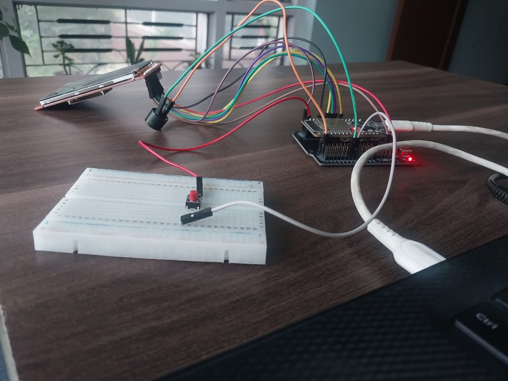

# 🎮 ESP32 Flappy Bird

> **A playable Flappy Bird game built from scratch using an ESP32 and TFT display.**

I wanted to see how far I could take a simple game using an embedded system,so I built my own version of **Flappy Bird** using an ESP32.

The bird is controlled using a physical push button, while the ESP32 handles the game logic, movement, collision detection, scoring, graphics, and sound feedback.

---

## 🕹️ Demo

### 🎮 Gameplay


### 🔧 Hardware



### 🎥 Demo Video

[▶️ Watch the gameplay video](demo.mp4)

---

##  Features

*  Button-controlled bird
*  Gravity-based bird movement
*  Moving pipes
*  Pipe and boundary collision detection
*  Score and high-score tracking
*  Increasing difficulty as the score increases
*  Buzzer feedback
*  Game restart system
*  320×240 TFT graphics
*  Button debouncing

---

## 🔧 Hardware

| Component    |    Quantity |
| ------------ | ----------: |
| ESP32        |           1 |
| TFT Display  |           1 |
| Push Button  |           1 |
| Buzzer       |           1 |
| Breadboard   |           1 |
| Jumper Wires | As required |

---

## 🔌 Connections

### TFT → ESP32

| TFT Pin | ESP32         |
| ------- | ------------- |
| VCC     | 3.3V          |
| GND     | GND           |
| LED     | 3.3V          |
| CS      | GPIO 5        |
| DC      | GPIO 17       |
| RST     | GPIO 4        |
| MOSI    | GPIO 23       |
| SCLK    | GPIO 18       |
| MISO    | Not connected |

### Other Components

| Component   | ESP32   |
| ----------- | ------- |
| Push Button | GPIO 25 |
| Buzzer      | GPIO 33 |

---

## How It Works

The game runs through three main states:

```text
┌──────────────┐
│ START SCREEN │
└──────┬───────┘
       │ Button
       ▼
┌──────────────┐
│   PLAYING    │
└──────┬───────┘
       │ Collision
       ▼
┌──────────────┐
│  GAME OVER   │
└──────┬───────┘
       │ Button
       └──────────────► PLAYING
```

During gameplay:

**Button pressed**
↓
Bird receives upward velocity
↓
Gravity pulls the bird downward
↓
Pipes continuously move across the screen
↓
ESP32 checks for collisions
↓
Successful pipe passage increases the score
↓
Every **5 points**, the pipe speed increases

---

##  Controls

| Action     | Control                      |
| ---------- | ---------------------------- |
| Start game | Press button                 |
| Flap       | Press button                 |
| Restart    | Press button after Game Over |

---

##  Software

* **ESP32**
* **Arduino/C++**
* **TFT_eSPI**
* **Arduino IDE**

The TFT is configured in landscape orientation at **320×240** resolution.

---

##  Project Structure

```text
esp32-flappy-bird/
│
├── src/
│   └── flappy_bird.ino
│
├── img1.jpg
├── img2.jpg
├── img3.jpg
├── demo.mp4
│
└── README.md
```

---

##  What I Practised

This project was a hands-on exercise in:

* Embedded graphics
* TFT display interfacing
* Digital input handling
* Game physics
* Collision detection
* Timing and frame updates
* Audio feedback
* Hardware-software integration

---

##  Future Ideas

Possible improvements for a future version:

* More game modes
* Additional sound effects
* Better animations
* High-score persistence
* Additional controls

---

### Built with ESP32 +  TFT +  push button + buzzer

